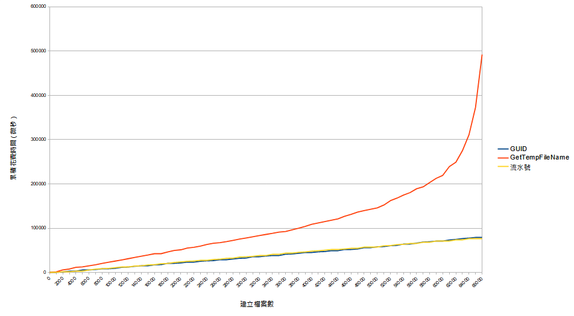

# Win32API以及C#的GetTempFileName的潛藏問題

## 前言
最近同事在使用C#產暫存檔的時候有遇到了一些問題，矛頭指向Path.GetTempFileName這個方法，這使我懷疑是否與過去曾在c++的Win32類似名稱的方法所出現的問題相同呢，故稍微研究記錄一下。

## API
首先先附上這兩隻API的官方文件。
* ### [GetTempFileNameA(c++ win32API)](https://learn.microsoft.com/zh-tw/windows/win32/api/fileapi/nf-fileapi-gettempfilenamea)
* ### [Path.GetTempFileName(C#)](https://learn.microsoft.com/zh-tw/dotnet/api/system.io.path.gettempfilename?view=net-8.0)

## 潛藏問題
### 這兩個方法都會建立空檔案，而不僅是只提供檔名。
   * win32 
   * C# 
### 無法建立超過65535個檔案。
   * win32 
   * C# 
### 效能問題
   文件中均有提到這兩個方法在建立大量檔案時會產生效能瓶頸，這邊有使用c++API做一個簡單測試。

   測試環境: ssd+cpu:i5-4460
   

## 解決以上問題的方法
其實官方文檔就有提到一些對應措施了
1. 使用GUID作為文件名稱。
2. 使用Path.GetRandomFileName(C#)，須注意此方法不會建立檔案。
3. 
## 參考資源
* https://learn.microsoft.com/zh-tw/windows/win32/api/fileapi/nf-fileapi-gettempfilenamea
* https://learn.microsoft.com/zh-tw/dotnet/api/system.io.path.gettempfilename?view=net-8.0